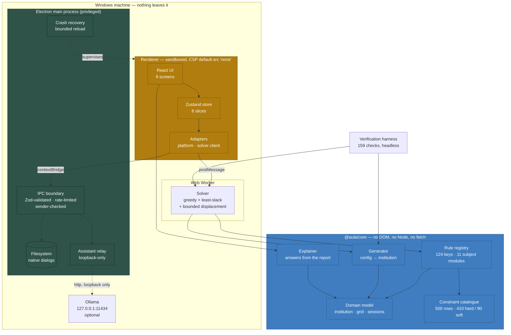

# Aula

**A constraint-driven university timetable planner that explains itself.**

Aula takes the figures a registrar already has — programmes, sections, rooms,
staff, teaching hours — and produces a weekly timetable against a catalogue of
500 named constraints. When something will not fit, it says which constraint
refused it and how many placements that constraint blocked.

It runs entirely on one Windows machine. No server, no database, no account,
no internet connection. The only network destination it will ever contact is a
language model on `127.0.0.1`, and only if the user installs one.

Built for **SIH25028 — Smart Classroom & AI Timetable Scheduler**.

---

## Why it is built this way

A timetable is not a hard problem because the search is large. It is a hard
problem because when the answer is "no", somebody has to explain why to a head
of department.

So the constraint catalogue is data, not code — 500 numbered rows an
administrator can read, switch off, and reweight without a developer. Of those,
**301 are enforced by the engine and 199 are advisory**, and the interface says
which is which on every screen and in every export. A constraint that cannot be
decided from a weekly-teaching data model is tracked for human sign-off rather
than quietly implied to be checked.

That distinction is enforced, not documented: `npm run verify` fails if a row
claims a rule the registry does not implement.

---

## Architecture



The three colours are the three trust levels. Green is privileged and small.
Amber is the renderer — the largest body of code, where injected content would
land, and therefore the part that is sandboxed and allowed to reach nothing.
Blue is pure computation that cannot reach a host API at all, which is what
lets the same code run in the renderer, in a Web Worker and headless in CI.

`ARCHITECTURE.md` goes into the patterns and why each boundary is where it is.

---

## Getting started

Requires **Node 24.18.1** (see `.nvmrc`) and npm 10.9+.

```bash
npm install
npm run dev
```

That builds the Electron main and preload bundles, starts Vite, and launches
the app. To work on the interface alone in a browser:

```bash
npm run dev:web
```

The browser build is fully usable — file save and open degrade to downloads and
a file picker. Only the local assistant needs the desktop shell.

---

## Commands

Everything runs from the repository root.

| Command                        | What it does                                                     |
| ------------------------------ | ---------------------------------------------------------------- |
| `npm run dev`                  | Vite + Electron                                                  |
| `npm run dev:web`              | renderer only, in a browser                                      |
| `npm run check`                | the full gate: format, lint, typecheck, test, verify             |
| `npm run verify`               | **the number that counts** — 159 headless checks over the engine |
| `npm test`                     | Vitest across four projects                                      |
| `npm run test:coverage`        | the same, with a coverage report                                 |
| `npm run typecheck`            | four TypeScript projects, full strict                            |
| `npm run lint`                 | oxlint over the tree                                             |
| `npm run format`               | Prettier                                                         |
| `npm run new -- <what> <name>` | scaffold a page, rule, slice or component                        |
| `npm run audit:licenses`       | fails on strong copyleft in the shipped graph                    |
| `npm run i18n:report`          | how much of the interface is translatable                        |
| `npm run package`              | Windows installer, NSIS + portable                               |
| `npm run docker:up`            | the browser build in a container                                 |

---

## Repository layout

```
packages/core/          @aula/core — the domain
  src/data/             model, configuration, generator, catalogue, importers
  src/engine/           rule registry (11 subject modules), solver, explainer
  scripts/harness.ts    the 159-check verification harness
  tsconfig.json         lib ES2023, types [] — no DOM, no Node, enforced

apps/desktop/           @aula/desktop — the Electron application
  electron/             main process, preload, IPC contracts, telemetry, recovery
  src/pages/            9 screens, one directory each where they are large
  src/store/            8 slices
  src/adapters/         host-specific edges
  src/i18n/             translation bundle, keys checked at compile time

tools/cli/              @aula/cli — scaffolding (`npm run new`)
tools/scripts/          licence audit, git hooks, version stamping, i18n report
deploy/                 nginx, Kubernetes, systemd
docs/                   architecture, audits, decisions, execution log
```

---

## What the numbers mean

Every figure below is produced by `npm run verify` on the default
configuration, not asserted by hand. Quoting an unmeasured number is the first
rule in `CLAUDE.md` for a reason: this application's whole value is that its
explanations are true.

|                     |                                                                                        |
| ------------------- | -------------------------------------------------------------------------------------- |
| Constraints         | 500 — 410 hard, 90 soft; 301 enforced, 199 advisory, 72 parameterised                  |
| Rule registry       | 124 keys across 11 subject modules, each exactly one of check/cost/audit               |
| Default institution | 4 buildings, 28 rooms, 5 departments, 90 courses, 24 cohorts, 1,365 students, 68 staff |
| Result              | 360 / 360 sessions placed, 0 hard violations, 34.3% room utilisation                   |
| Solve time          | ~1.7 s                                                                                 |
| Verification        | 159 checks, all passing                                                                |
| Tests               | 210 across 4 Vitest projects                                                           |
| Accessibility       | 0 axe violations, 9 routes × 3 themes                                                  |
| Licences            | 62 shipped packages, 0 strong copyleft                                                 |
| Vulnerabilities     | 0 in the shipped graph                                                                 |

The harness **re-derives** every hard invariant itself — it recounts double
bookings, capacity breaches and unqualified assignments from the output rather
than believing the solver's report. A solver bug cannot mark its own homework.

---

## Privacy

- Nothing is transmitted. There is no server, no analytics and no update check.
- The renderer's Content-Security-Policy is `default-src 'none'` with
  `connect-src 'none'`. It is not permitted to make a network request at all.
- Typefaces are bundled. An earlier build fetched them from Google on every
  launch, which contradicted this section and broke offline.
- Crash reporting exists but ships **off**: it needs a DSN _and_ consent, and
  the SDK is not even loaded without both. What a report may contain is
  constructed from a fixed list — versions and a stack trace, never a course,
  room, person or file path.

---

## Documentation

|                                                                                    |                                                              |
| ---------------------------------------------------------------------------------- | ------------------------------------------------------------ |
| [ARCHITECTURE.md](ARCHITECTURE.md)                                                 | the patterns, the boundaries and why they are where they are |
| [CONTRIBUTING.md](CONTRIBUTING.md)                                                 | how to work in this repository                               |
| [CHANGELOG.md](CHANGELOG.md)                                                       | generated from commit subjects                               |
| [docs/security-audit-owasp.md](docs/security-audit-owasp.md)                       | OWASP Top 10, adapted to a desktop application               |
| [docs/audit-accessibility-performance.md](docs/audit-accessibility-performance.md) | before and after, measured                                   |
| [docs/disaster-recovery.md](docs/disaster-recovery.md)                             | recovery and rollback                                        |
| [docs/decisions.md](docs/decisions.md)                                             | numbered architecture decisions                              |
| [docs/CONTEXT.md](docs/CONTEXT.md)                                                 | execution log and bug history — append only                  |
| [CLAUDE.md](CLAUDE.md)                                                             | the working agreement for agents in this repository          |

---

## Known limits

Stated plainly, because a tool that overstates itself is worse than one that
does less.

- **199 of 500 constraints are advisory.** They are tracked, weighted,
  switchable and exported for sign-off, but the engine cannot decide them from
  a weekly-teaching data model — exam seating, hazardous-waste windows,
  catering rotas. Extending the model is the path to enforcing more.
- **The solver does not prove optimality.** It is a constraint-guided greedy
  placer with least-slack ordering, a bounded candidate search and a
  displacement pass. It guarantees every enabled hard constraint and minimises
  weighted soft cost. A CP-SAT backend would prove more.
- **Exam scheduling is out of scope.** Aula schedules the weekly teaching
  timetable.
- **The assistant needs Ollama installed.** Without it the page falls back to a
  deterministic explainer that reads the report and cannot invent anything.
- **i18n is 24% complete.** The mechanism is in place and keys are checked at
  compile time; 376 interface strings are still literal. `npm run i18n:report`
  tracks it.

---

## Licence

Not yet chosen — every manifest says `UNLICENSED`. Third-party licences are
reproduced in [THIRD-PARTY-NOTICES.md](THIRD-PARTY-NOTICES.md), regenerated on
every release.
